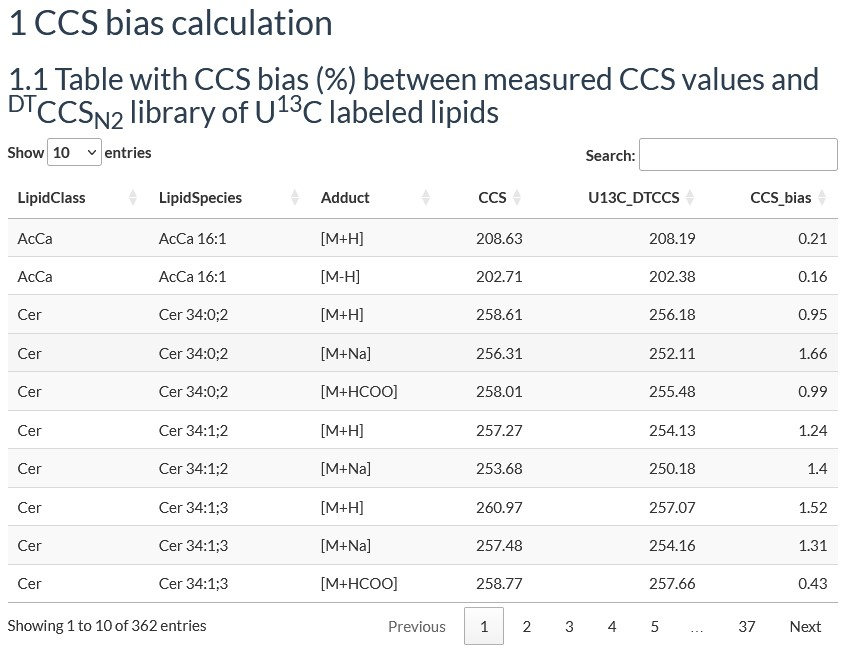
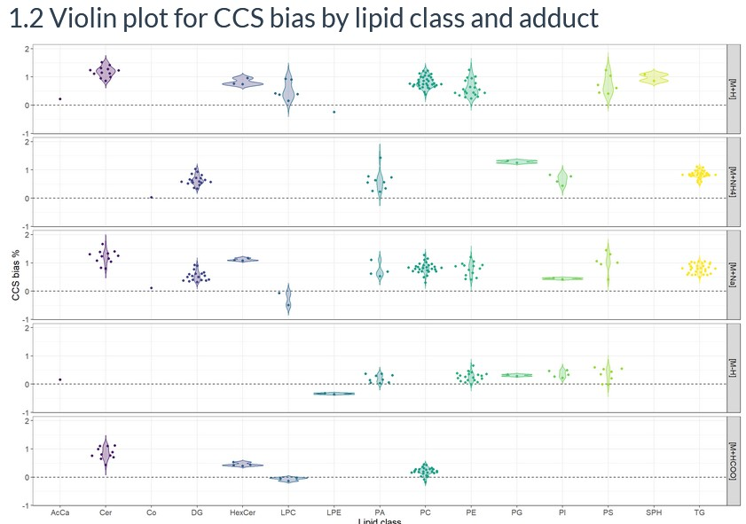
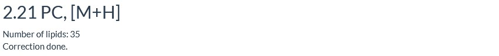
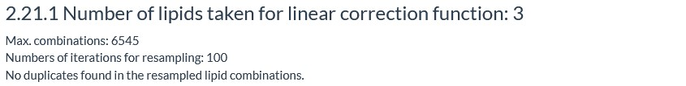
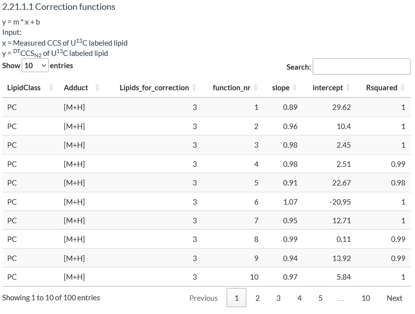
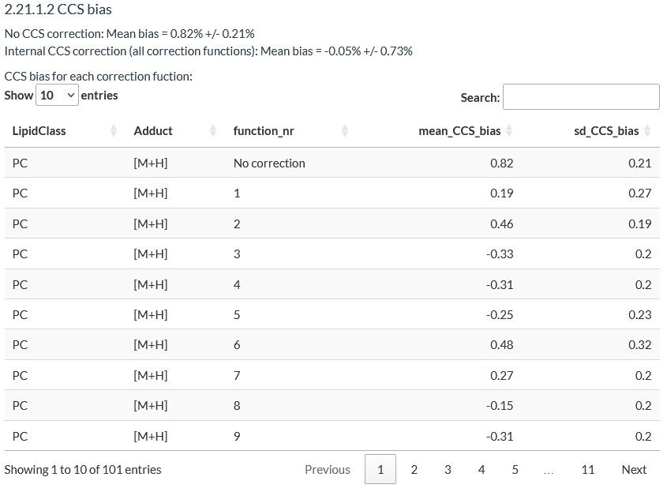
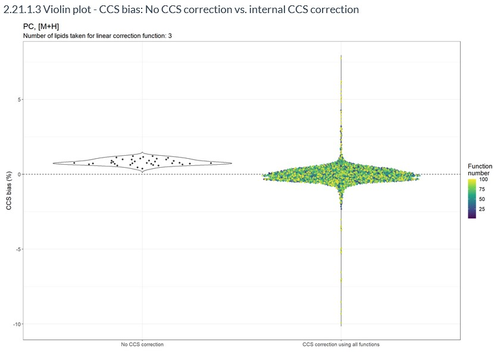
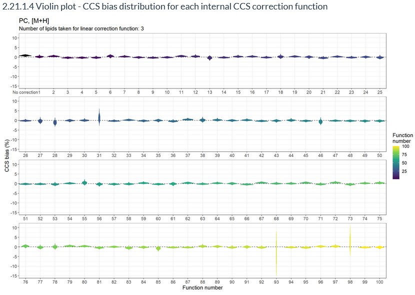
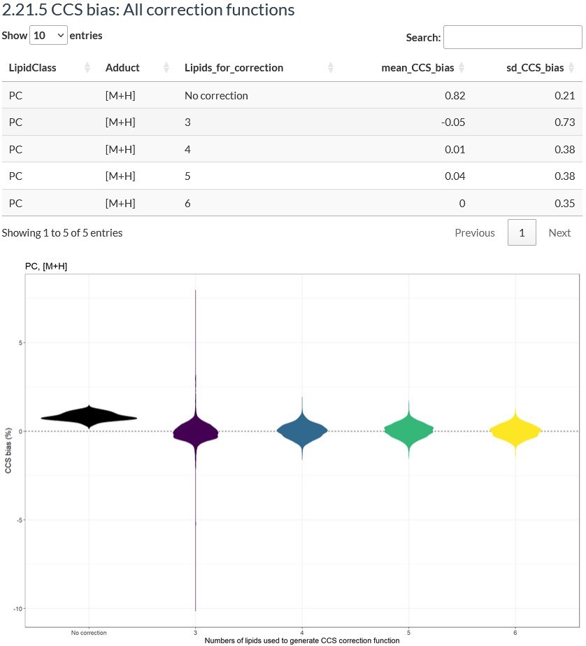

<p align="center">
{width="400"}
</p>

# MobiLipid: A Tool for Enhancing CCS Quality Control of Ion Mobility-Mass Spectrometry Lipidomics by Internal Standardization

MobiLipid aims to streamline lipidomics workflows by offering a fully automated solution for assessing and correcting collision cross section (CCS) bias in ion mobility-mass spectrometry (IM-MS) analyses. Employing a newly established ^DT^CCS~N2~ library for U^13^C labeled lipids, which is provided together with the code, MobiLipid eliminates the need to measure additional external calibration besides vendor specific calibration requirements by internal standardization. Our tool enhances CCS quality control by providing a R Markdown that integrates into IM-MS lipidomics workflows, requiring a low number of lipids detected per lipid class for effective implementation of CCS bias calculation and correction.

## Introduction to MobiLipid

MobiLipid is a R markdown enabling CCS quality control for IM-MS lipidomics by internal standardization. For utilizing the MobiLipid workflow samples measured with (LC-)IM-MS have to be spiked with U^13^C labeled internal standards (fully labeled yeast extract [@neubauer13CellExtract2012]). Subsequently, it is possible to utilize the ^DT^CCS~N2~ library for U^13^C labeled lipids (provided together with the code and publication) to first calculate CCS bias between measured CCS values and library values of U^13^C labeled lipids. Additionally, MobiLipid allows for the correction of CCS values by computing correction function for each lipid class-adduct combinations (possible combinations are listed in the table below, see [Running MobiLipid]). CCS correction functions are based on linear regression functions which require a minimum of 3 lipids within a lipid class-adduct combination which restricts the CCS correction to the following lipid classes: Cer, DG, HexCer, LPC, PA, PC, PE, PI, PS, and TG. MobiLipid computes up to 100 distinct correction functions employing 3 to 6 lipids of a lipid class-adduct combination for linear regression. Input values for linear regression using the equation $y = m * x + b$ are measured CCS values of U^13^C labeled lipids as x value and ^DT^CCS~N2~ library values as y value. After generation of all CCS correction functions, all measured CCS values are corrected, irrespective of their labeling status. To monitor the result of CCS correction, the bias between corrected CCS values and ^DT^CCS~N2~ library values of U^13^C labeled lipids is calculated.

## Cite MobiLipid

Please cite the following publication if you use MobiLipid in your workflow:
Hildebrand, Felina; Koellensperger, Gunda; Causon, Tim. MobiLipid: A Tool for Enhancing CCS Quality Control of Ion Mobility–Mass Spectrometry Lipidomics by Internal Standardization. *Anal. Chem.* **2024**, *96* (19), 7380–7385. https://doi.org/10.1021/acs.analchem.4c01253.


## Necessary installations

To run MobiLipid it is necessary to install [R](https://cran.r-project.org/) and [R studio](https://www.rstudio.com/products/rstudio/download/).

Afterwards, it has to be ensured that all necessary packages, which are needed to run MobiLipid, are installed. Therefore, paste the following code into the console of R studio and press enter.

```{r, include=TRUE, eval=FALSE}
# List of packages to check/install
packages <- c("htmltools" ,"rmarkdown", "data.table", "ggplot2", "DT", "webshot", "tcltk", "knitr", "ggbeeswarm")

# Check if packages are installed, if not, install them
for (package in packages) {
  if (!requireNamespace(package, quietly = TRUE)) {
    install.packages(package)
  }
}
```

## Downloading MobiLipid

Furthermore, it has to be ensured that the .Rmd file containing MobiLipid ("MobiLipid_CCS-bias-calculation.Rmd" and/or "MobiLipid_CCS-bias-calculation_CCS-correction.Rmd") as well as the .csv file of the ^DT^CCS~N2~ library for U^13^C labeled lipids of yeast ("U13C_DT_CCS_library.csv") is downloaded. This can be done by downloading the entire GitHub repository as a .zip file and unzip the files.

## Running MobiLipid

Finally, MobiLipid can be run. Therefore, paste the code below into the console of R studio and press enter. The code will open 3 pop-up windows where you have to choose the following files (be aware that the windows might open behind the main window of R studio):

1.  **Select the R markdown which should be used for data processing:**

    This needs to be a .Rmd file.

    -   "*MobiLipid_CCS-bias-calculation.Rmd*" can be used to calculate the CCS bias between measured CCS values and ^DT^CCS~N2~ library values of U^13^C labeled yeast lipids
    -   "*MobiLipid_CCS-bias-calculation_CCS-correction.Rmd*" to additionally perform a CCS correction based on linear correction functions using the ^DT^CCS~N2~ library.

2.  **Data import (measured data as .csv file):**

    This needs to be a .csv file containing the measured data. The .csv file has to have the following headers: "File", "LipidClass", "LipidSpecies", "Adduct", "Label", "CCS" (an exemplary file is provided: "*Example_data_import.csv*")

    -   **File**: File name of the measurement file

    -   **LipidClass**: Lipid class (ensure to use the same nomenclature as used for the ^DT^CCS~N2~ library)

    -   **LipidSpecies**: Lipid species on lipid species level (ensure to use the same nomenclature as used for the ^DT^CCS~N2~ library)

    -   **Adduct**: The following adducts are possible: [M+H], [M+NH~4~], [M+Na], [M-H], and [M+HCOO]. Not all adducts can be used for each lipid class. The table below shows the possible lipid class-adduct combinations:

        | Lipid class | Adducts                 |
        |-------------|-------------------------|
        | AcCa        | [M+H], [M-H]            |
        | Cer         | [M+H], [M+Na], [M+HCOO] |
        | Co          | [M+NH4], [M+Na]         |
        | DG          | [M+NH4], [M+Na]         |
        | HexCer      | [M+H], [M+Na], [M+HCOO] |
        | LPC         | [M+H], [M+Na], [M+HCOO] |
        | LPE         | [M+H], [M-H]            |
        | PA          | [M+NH4], [M+Na], [M-H]  |
        | PC          | [M+H], [M+Na], [M+HCOO] |
        | PE          | [M+H], [M+Na], [M-H]    |
        | PG          | [M+NH4], [M-H]          |
        | PI          | [M+NH4], [M+Na], [M-H]  |
        | PS          | [M+H], [M+Na], [M-H]    |
        | SPH         | [M+H]                   |
        | TG          | [M+NH4], [M+Na]         |

    <!-- -->

    -   **Label**: "light" for natural lipids and "heavy" for U^13^C labeled lipids
    -   **CCS**: Measured CCS value

3.  **Import .csv file of U^13^C labeled lipid CCS library**:

    This needs to be a .csv file containing the ^DT^CCS~N2~ library. It is provided with the code and called "*U13C_DT_CCS_library.csv*".

**Code to run MobiLipid:**

```{r, include=TRUE, eval=FALSE}
# Choose R markdown which should be processed
Rmd <- tcltk::tk_choose.files(caption = "Select R markdown (.Rmd file) which should be used for data processing:",
                              filters = matrix(c("Rmd files", "Rmd"), 1, 2),
                              multi = FALSE)
Rmd_name <- basename(Rmd)
Rmd_name <- gsub("\\.Rmd$", "", Rmd_name)

# Get file path where the markdown is saved to save results in the same folder
folder_path <- dirname(Rmd)

# Import path of data which should be processed
data_import <- tcltk::tk_choose.files(caption = "Data import (measured data as CSV file):", 
                                      filters = matrix(c("csv files", "csv"), 1, 2),
                                      multi = FALSE)
filename <- basename(data_import)
filename <- gsub("\\.csv$", "", filename)

# Run R markdown
rmarkdown::render(
  paste0(Rmd),
  output_format = c("html_document", "pdf_document"),
  output_file = c(paste0(Rmd_name,"_",filename,".html"), paste0(Rmd_name,"_",filename,".pdf")))
```

## Output

As output MobiLipid generates a .html and a .pdf file with all data of CCS bias calculation and correction. Tables have to be accessed via the .html file (in the .pdf file only the first 10 rows for all tables are displayed). Following results are summarized in the output (e.g. for PC, [M+H], 3 lipids for linear regression):

-   CCS bias calculation without CCS correction

    

    

-   Number of lipids detected in the lipid class-adduct combination and if CCS correction was possible

    

-   Summary of resampling results to set up distinct correction functions

    

-   Summary of all generated correction functions by number of U^13^C labeled lipids used for generating them

    

-   Mean CCS bias before and after CCS correction for a lipid class-adduct combination over all correction functions by number of U^13^C labeled lipids used for generating them and for each correction function

    

-   Violin plots visualizing the CCS bias before and after CCS correction by number of U^13^C labeled lipids used for generating the correction functions

    

    

-   At the end of each lipid class-adduct combination there is a summary over the CCS bias before and after correction for each number of U^13^C labeled lipids used for generating the correction functions

    

Additionally, a .RData file is saved storing all results as a list which can be opened within R studio (`readRDS()`) and the following .csv files are generated:

-   **CCS bias calculation:**

    *CCS_bias_no_correction*: Table with CCS bias (%) before correction

-   **CCS bias calculation and correction:**

1.  *CCS_bias_no_correction*: Table with CCS bias (%) before correction
2.  *Correction_functions*: Table with all generated CCS correction functions
3.  *CCS_bias_mean_by_function*: Table with the mean CCS bias for each lipid class-adduct combination for each correction function
4.  *CCS_bias_mean_all_functions*: Table with the mean CCS bias for each lipid class-adduct combination over all correction functions with the same number of lipids used to generate the function
5.  *Corrected_CCS_values*: Table with corrected CCS values and CCS bias after correction for each lipid and each correction function
6.  *Corrected_CCS_values_mean*: Table with0 mean corrected CCS values for each lipid and all correction functions with the same number of lipids used to generate the function

## References
